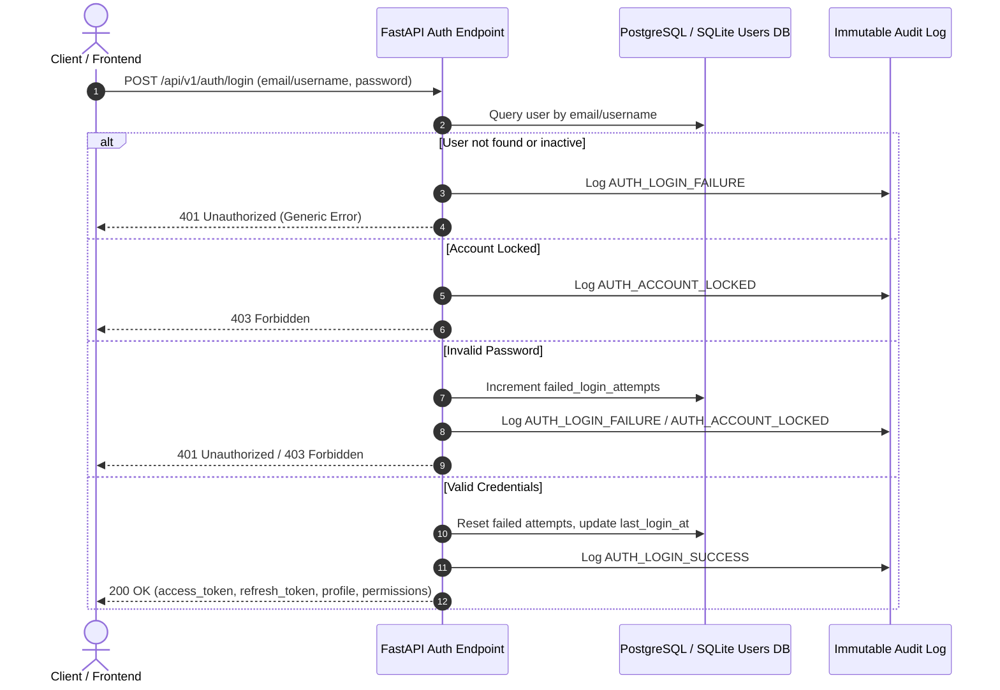

# CCATI Security & Role-Based Access Control (RBAC) Architecture

## 1. Executive Summary
The Customer Churn & Retention Intelligence (CCATI) platform implements an enterprise-grade security, authentication, and authorization architecture adhering to OWASP API Security and Zero-Trust standards.

---

## 2. Authentication Architecture

### 2.1 Token Lifecycle & Cryptographic Specifications
- **Access Tokens**: Short-lived JSON Web Tokens (default: 60 minutes) signed with HMAC-SHA256 (`HS256`).
- **Refresh Tokens**: Long-lived JSON Web Tokens (default: 7 days) signed with HMAC-SHA256 (`HS256`) restricted to `type: "refresh"` claim validation.
- **Subject Claim (`sub`)**: UUID-backed persistent user identifier verified against database records on each request.
- **Zero Mock Bypass**: All fallback tokens, default mock contexts, and hardcoded authentication bypasses have been completely removed. Requests missing or presenting invalid Bearer tokens receive `401 Unauthorized`.



---

## 3. Password Security & Account Protection

### 3.1 Password Hashing Mechanism
- **Algorithm**: `bcrypt` (12 rounds of automated salt generation).
- **Zero Plaintext Storage**: Plaintext passwords are never stored in databases, never written to log files, and never reflected in API payloads.
- **Complexity Validation**: Minimum 8 characters, requiring at least one letter and at least one numeric or special character.

### 3.2 Brute-Force & Account Lockout Protection
- Accounts with **5 consecutive failed login attempts** are automatically locked for **15 minutes**.
- Generic error messages ("Invalid email/username or password") are returned on failed attempts to prevent user enumeration.

---

## 4. Role-Based Access Control (RBAC) Matrix

### 4.1 Canonical System Roles
1. **`Admin`**: Full system administration, user management, audit review, model promotions, and system configuration.
2. **`RetentionManager`**: Campaign execution, subscriber retention actions, unmasking customer PII, and CSV data export.
3. **`Analyst`**: Data exploration, churn analytics, feature drift monitoring, and batch scoring.
4. **`ModelManager`**: Model registry management, performance evaluation, and candidate model promotions/rollbacks.
5. **`Operations`**: Real-time prediction scoring, subscriber risk inspection, and retention strategy dashboards.
6. **`Viewer`**: Read-only access to operational dashboards and reports.
7. **`Executive`**: High-level overview, macro KPIs, segmentation insights, and aggregated reports.

### 4.2 Centralized Permission Mapping Matrix

| Permission String | Admin | RetentionManager | Analyst | ModelManager | Operations | Viewer | Executive |
|---|:---:|:---:|:---:|:---:|:---:|:---:|:---:|
| `customer:read` | ✅ | ✅ | ✅ | ✅ | ✅ | ✅ | ✅ |
| `customer:pii_reveal` | ✅ | ✅ | ❌ | ❌ | ❌ | ❌ | ❌ |
| `customer:export` | ✅ | ✅ | ❌ | ❌ | ❌ | ❌ | ❌ |
| `prediction:read` | ✅ | ✅ | ✅ | ✅ | ✅ | ✅ | ✅ |
| `prediction:create` | ✅ | ✅ | ✅ | ✅ | ✅ | ❌ | ❌ |
| `scoring:job_trigger` | ✅ | ❌ | ✅ | ✅ | ❌ | ❌ | ❌ |
| `segmentation:read` | ✅ | ✅ | ✅ | ✅ | ✅ | ✅ | ✅ |
| `retention:read` | ✅ | ✅ | ✅ | ❌ | ✅ | ✅ | ✅ |
| `retention:write` | ✅ | ✅ | ❌ | ❌ | ❌ | ❌ | ❌ |
| `roi:read` | ✅ | ✅ | ✅ | ❌ | ✅ | ✅ | ✅ |
| `reports:read` | ✅ | ✅ | ✅ | ✅ | ✅ | ✅ | ✅ |
| `monitoring:read` | ✅ | ✅ | ✅ | ✅ | ✅ | ✅ | ✅ |
| `model:read` | ✅ | ✅ | ✅ | ✅ | ✅ | ✅ | ✅ |
| `model:promote` | ✅ | ❌ | ✅ | ✅ | ❌ | ❌ | ❌ |
| `model:rollback` | ✅ | ❌ | ❌ | ✅ | ❌ | ❌ | ❌ |
| `audit:read` | ✅ | ❌ | ❌ | ❌ | ❌ | ❌ | ❌ |
| `users:manage` | ✅ | ❌ | ❌ | ❌ | ❌ | ❌ | ❌ |
| `settings:manage` | ✅ | ❌ | ❌ | ❌ | ❌ | ❌ | ❌ |

---

## 5. API Endpoint Protection Architecture

```
HTTP Request
     │
     ▼
[OWASP Security Headers Middleware] ───► Injects X-Frame-Options, X-Content-Type-Options, etc.
     │
     ▼
[CORS Middleware] ─────────────────────► Validates allowed origins (No wildcards with credentials)
     │
     ▼
[Payload Size Guard] ──────────────────► Rejects payloads > 10MB with 413
     │
     ▼
[Authentication Dependency: get_current_user]
     ├── Validates Bearer JWT signature, expiration, and algorithm
     └── Queries DB user status (Deactivated -> 403, Locked -> 403, Missing -> 401)
     │
     ▼
[Authorization Dependency: require_roles / require_permission]
     ├── Verifies caller role against permitted roles list
     └── Insufficient permissions -> 403 Forbidden
     │
     ▼
[Endpoint Route Handler & Business Logic]
     │
     ▼
[Audit Logging Engine] ────────────────► Persists immutable audit records with user ID and action
```

### 5.1 Public vs. Protected Endpoints
- **Public Probes**:
  - `GET /health`: Liveness probe.
  - `GET /ready`: Readiness probe verifying DB, model registry, and artifact hashes.
  - `GET /`: API version and status.
  - `POST /api/v1/auth/login`: Credential validation.
  - `POST /api/v1/auth/refresh`: Token refresh.
- **Protected Business APIs**:
  - All routes under `/api/v1/customers`, `/api/v1/predict`, `/api/v1/predictions`, `/api/v1/segments`, `/api/v1/models`, `/api/v1/analytics`, `/api/v1/export`, `/api/v1/observability`, and `/api/v1/admin` strictly enforce authentication.

---

## 6. Frontend Security & Route Protection
- **`AuthContext` / `AuthProvider`**: Manages token storage, automatic refresh, profile state, and session invalidation.
- **`ProtectedRoute`**: Evaluates `isAuthenticated` and `hasRole(allowedRoles)`. Unauthenticated visitors are redirected to `/login`, while unauthorized roles are presented with a dedicated **403 Access Denied** view.
- **Axios / Fetch Interceptor**: Listens for HTTP 401 events to clear stale tokens and redirect to login.

---

## 7. Pre-Configured Test Accounts (Development & Staging)

| Role | Email / Username | Default Password | Granted Scope |
|---|---|---|---|
| **Admin** | `admin@telecom.com` (`admin`) | `AdminPassword123!` | Full System Administration |
| **RetentionManager** | `manager@telecom.com` (`retention_manager`) | `ManagerPassword123!` | Campaigns, PII Reveal, CSV Export |
| **Analyst** | `analyst@telecom.com` (`data_analyst`) | `AnalystPassword123!` | Churn Analytics, Monitoring, Models |
| **ModelManager** | `modelmanager@telecom.com` (`model_manager`) | `ModelPassword123!` | Model Promotion & Retraining |
| **Operations** | `operations@telecom.com` (`operations_user`) | `OpsPassword123!` | Real-time Predictions & Risk Tiers |
| **Viewer** | `viewer@telecom.com` (`viewer`) | `ViewerPassword123!` | Read-Only Dashboards & Reports |
| **Executive** | `executive@telecom.com` (`executive_user`) | `Password123!` | Executive KPIs & Reports |

---

## 8. Running Authentication Locally

```bash
# 1. Seed users and verify database tables
.venv/bin/python backend/scripts/seed_users.py

# 2. Run backend API server
.venv/bin/uvicorn backend.app.main:app --host 0.0.0.0 --port 8000 --reload

# 3. Run frontend development server
npm --prefix frontend run dev

# 4. Run automated security and RBAC test suite
.venv/bin/pytest tests/test_auth_rbac.py -v
```
